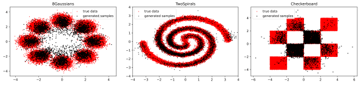

## Welcome to the generative modelling trip

Here you can find some useful information (i hope so) to embark on a journey
through generative models. You can find _theoretical notes_ about
generative models and code for the _realization_.

> How to run?

Go to the folder with interesting model and
```python
python main.py --{option} {value}
```
__Docker__
```python
docker build dockerfiles/Dockerfile
```
---------
### __Energy based models__

- Theory
    - [Put](./ebm/theory/EBM.pdf). My notes including introduction to EBM, Maximum Likelihood training with MCMC,
      MCMC base theory, Metropolis-Hastings method, Hamiltonian and Langevin dynamics,
      score matching (denoising, sliced) for training EBM, noise contrastive estimation.
    - [Must read](https://arxiv.org/abs/2101.03288). Paper of Yang Song about EBM.
    - [Must read](https://yang-song.github.io/blog/2019/ssm/). Blog of Yang Song about sliced score matching.
    - [Must watch](https://www.youtube.com/watch?v=3-KzIjoFJy4). Lecture from DeepBayes group about Langevin dynamics
    - [Must read](https://bjlkeng.github.io/posts/hamiltonian-monte-carlo/). Blog about Hamiltonian Monte Carlo (also
      information about MCMC can be found).

- Code
    - [Put](./ebm/mle_mcmc). Realization of the Maximum Likelihood training with MCMC
    - in progress. Realization of the Noise Contrastive Estimation
- Results
    - __NCE__ (toy example)
      <p align="center">
      
      </p>

-------------

### __Variational Auto Encoders__

- Theory
  - [Put](./VAE/theory/TheorIntro.pdf). My notes about VAE (motivation, evidence lower bound, EM algorithm,
  something from information theory)
  - [Must read](https://arxiv.org/abs/1606.05908). Tutorial about VAE, great to start.
  - [Must read](https://arxiv.org/abs/1312.6114?context=cs.LG). Original paper about VAE.
- Code
  - [Put](./VAE). Realization of the VAE
- Results \
 in progress

---------------

### __Variational Auto Encoder with Normalizing flow__
- Theory
  - [Put](./vae_flows/theory/vae_flows_theory.pdf).  My short notes about combination of normalizing flows with VAE (motivation and derivation)
  - [Must read](https://uvadlc-notebooks.readthedocs.io/en/latest/tutorial_notebooks/tutorial11/NF_image_modeling.html). Tutorial about normalizing flows 
  - [Must read](https://arxiv.org/pdf/1505.05770.pdf). Original paper
- Code
  - [Put](./vae_flows). Realization of planar flows and VAE with normalizing flows
- Results \
 in progress

----------------

### __Generative Adversarial Network__
- Theory
  - in progress.  My notes about GAN (some thoughts about instability, view on loss function)
  - [Must read]. A lot of stuff on the internet.
  - [Must read](https://arxiv.org/abs/1406.2661). Original paper
- Code
  - [Put](./GAN). Realization of GAN
- Results \
 in progress
----------------

### __Wasserstein GAN__
- Theory
  - [Put](./WGAN/theory/WGAN.pdf).  My notes about WGAN (discussions about the main problem of the GAN)
  - [Must read](https://www.alexirpan.com/2017/02/22/wasserstein-gan.html). Tutorial about WGAN
  - [Must watch](https://www.youtube.com/watch?v=ymWDGzpQdls&t=692s). Great explanation of Wasserstein distance (Earth Mover's Distance)
  - [Must read](https://arxiv.org/abs/1701.07875?context=cs). Original paper
- Code
  - [Put](./GAN). Realization of WGAN
- Results \
 in progress

--------------

### __VAE GAN__
- Theory
  - [Put](./vae_gan/theory/VaeGan_theory.pdf).  My notes about VAE GAN
  - [Must read](https://arxiv.org/abs/1512.09300?context=cs.CV). Original paper
- Code
  - [Put](./vae_gan). Realization of VAE GAN
- Results \
 in progress

------------

### __Adversarial Auto Encoder__
- Theory
  - [Put](./adversarial_auto_encoder/theory/AAE_some_theory.pdf).  My notes about AAE
  - [Must read](https://arxiv.org/abs/1511.05644). Original paper
- Code
  - [Put](./vae_gan). Realization of AAE
- Results \
 in progress