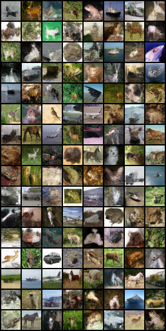
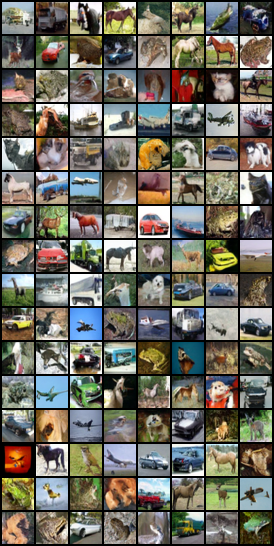
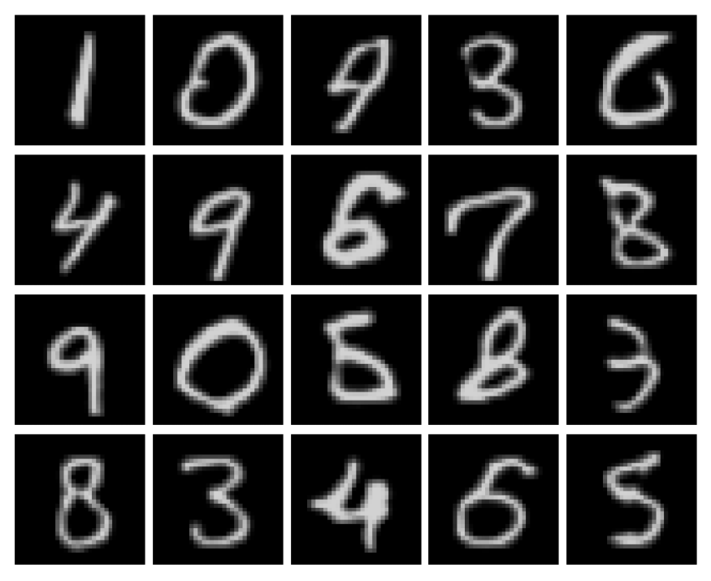
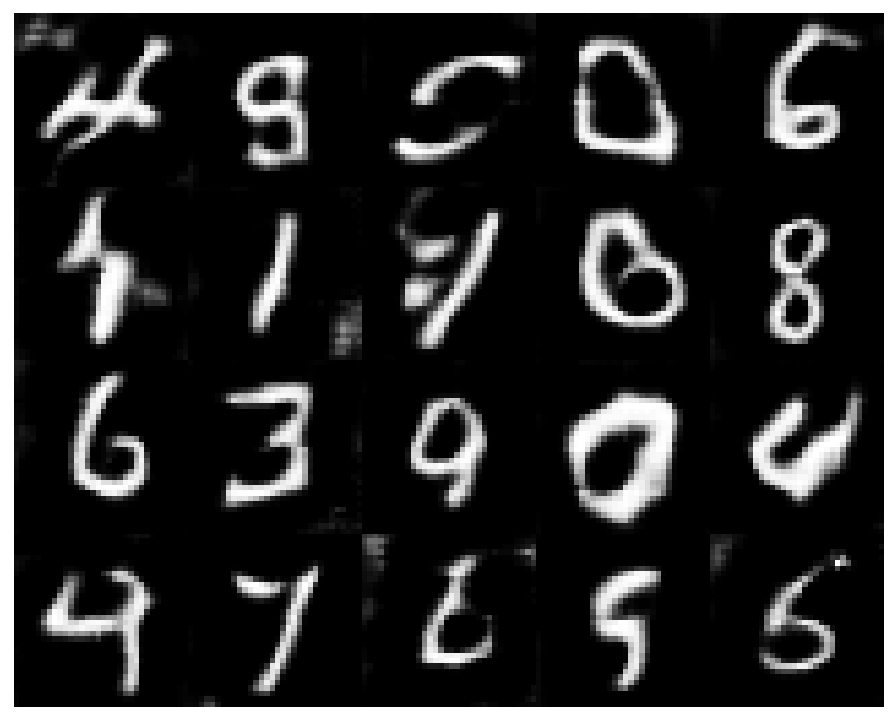

## Journey through generative modeling

Here you can find some useful information for embarking on a journey through generative models. 
You will find __theoretical notes__ about different generative models, as well as code for their __realization__.

> How to run?

Go to the folder with interesting model and
```python
python main.py --{option} {value}
```
__Docker__
```python
docker build dockerfiles/Dockerfile
```
---------
### Table of contents
* [Distilled Diffusion Models](#distilled-diffusion-models)
* [Energy based models](#energy-based-models)
* Score based models
  * [Noise conditional score model](#noise-conditional-score-model)
  * [Denoising Diffusion Probabilistic Models](#denoising-diffusion-probabilistic-models)
  * [Stochastic Score based Models](#score-based-models-through-sde)
* Variational Auto Encoders
  * [Traditional VAE](#variational-auto-encoders) 
  * [VAE with normalizing flows](#variational-auto-encoder-with-normalizing-flow)
  * [VAE GAN](#vae-gan)
* Generative Adversarial Networks 
  * [Classical GAN/DCGAN](#generative-adversarial-network)
  * [Wasserstein GAN](#wasserstein-gan)
  * [Adversarial Auto Encoder](#adversarial-auto-encoder)
  * [Boundary Equilibrium Generative Adversarial Networks](#boundary-equilibrium-generative-adversarial-networks)
* Other stuff
  * [Transformer/ViT](./vit/ViT.pdf) 

---------
### Distilled Diffusion Models
- Theory
  - [Click](./distilled_diffusion/theory/Distilled_diffusion_models.pdf). My notes on [Consistency Models](https://arxiv.org/abs/2303.01469), 
  [Multistep Consistency Models](https://arxiv.org/abs/2403.06807), [PaGoDa](https://arxiv.org/abs/2405.14822), 
  [DMD](https://openaccess.thecvf.com/content/CVPR2024/html/Yin_One-step_Diffusion_with_Distribution_Matching_Distillation_CVPR_2024_paper.html), 
  [ADD](https://arxiv.org/abs/2311.17042) and [Score Identity Distillation](https://openreview.net/forum?id=QhqQJqe0Wq)

---------
### Energy based models

- Theory
    - [Click](./ebm/theory/EBM.pdf). My notes including introduction to EBM, Maximum Likelihood training with MCMC,
      MCMC base theory, Metropolis-Hastings method, Hamiltonian and Langevin dynamics,
      score matching (denoising, sliced) for training EBM, noise contrastive estimation.
    - [Must read](https://arxiv.org/abs/2101.03288). Paper of Yang Song about EBM.
    - [Must read](https://yang-song.github.io/blog/2019/ssm/). Blog of Yang Song about sliced score matching.
    - [Must watch](https://www.youtube.com/watch?v=3-KzIjoFJy4). Lecture from DeepBayes group about Langevin dynamics
    - [Must read](https://bjlkeng.github.io/posts/hamiltonian-monte-carlo/). Blog about Hamiltonian Monte Carlo (also
      information about MCMC can be found).

- Code
    - [Click](./ebm/mle_mcmc). Realization of the Maximum Likelihood training with MCMC
    - in progress. Realization of the Noise Contrastive Estimation
- Results
    - __NCE__ model (toy example)
      <p align="center">
      
      </p>

-------------

### Score based models through SDE

- Theory
    - [Click](./stochddpm/theory/SDE_ODE_framework.pdf). My notes about stochastic ddpm
    - [Click](./stochddpm/theory/StochDDPM.pdf). My notes about stochastic ddpm 2
    - [Must read](https://openreview.net/forum?id=PxTIG12RRHS). Original paper.
    - [Must read](https://yang-song.net/blog/2021/score/). Blog of Yang Song about SBM.
    - [Must watch](https://colab.research.google.com/drive/120kYYBOVa1i0TD85RjlEkFjaWDxSFUx3?usp=sharing). Colab notebook with example
- Code
    - [Click](./stochddpm). Realization of the Stochastic DDPM
- Results
      <p align="center">
      
      </p>

-------------

### Noise conditional score model

- Theory
    - [Click](./score/theory/ScoreBased.pdf). My notes about score based models (mostly based on previous notes about EBM)
    - [Must read](https://arxiv.org/abs/1907.05600). Original paper about score based generative models.
    - [Must read](https://yang-song.net/blog/2021/score/). Blog of Yang Song about SBM.
    - [Must read](https://arxiv.org/pdf/2006.09011.pdf). Paper with some techniques about how to train SBM.
    - [Must watch](https://www.youtube.com/watch?v=8TcNXi3A5DI&t=4056s). Lecture from Stefano Ermon.
- Code
    - [Click](./score). Realization of the Score Matching with Denoising Score Matching.
- Results
      <p align="center">
      
      </p>
      <p align="center">
      
      </p>

-------------
### Denoising Diffusion Probabilistic Models

- Theory
    - [Click](./ddpm/theory/DDPM.pdf). My notes about DDPM
    - [Must read](https://arxiv.org/abs/2006.11239). Original paper about score based generative models.
    - [Must read](https://yang-song.net/blog/2021/score/). Blog of Yang Song about SBM.
- Code
    - [Click](./ddpm). Realization of the DDPM.
- Results
      <p align="center">
      
      </p>
      <p align="center">
      
      
      </p>
- 
-------------
### Variational Auto Encoders

- Theory
  - [Click](./VAE/theory/VAE.pdf). My notes about VAE (motivation, evidence lower bound, EM algorithm,
  something from information theory)
  - [Must read](https://arxiv.org/abs/1606.05908). Tutorial about VAE, great to start.
  - [Must read](https://arxiv.org/abs/1312.6114?context=cs.LG). Original paper about VAE.
- Code
  - [Click](./VAE). Realization of the VAE
- Results
  - MNIST 
      <p align="center">
      
      </p>

---------------
### Variational Auto Encoder with Normalizing flow
- Theory
  - [Click](./vae_flows/theory/vae_flows_theory.pdf).  My short notes about combination of normalizing flows with VAE (motivation and derivation)
  - [Must read](https://uvadlc-notebooks.readthedocs.io/en/latest/tutorial_notebooks/tutorial11/NF_image_modeling.html). Tutorial about normalizing flows 
  - [Must read](https://arxiv.org/pdf/1505.05770.pdf). Original paper
- Code
  - [Click](./vae_flows). Realization of planar flows and VAE with normalizing flows
- Results
  - MNIST 
      <p align="center">
      
      </p>

----------------
### Generative Adversarial Network
- Theory
  - [Must read](https://arxiv.org/abs/1406.2661). Original paper
- Code
  - [Click](./GAN). Realization of GAN
- Results
   - MNIST (DCGAN)
      <p align="center">
      
      </p>
  
------------
### Boundary Equilibrium Generative Adversarial Networks
- Theory
  - [Click](./began/theory/BEGAN.pdf).  My notes about BEGAN
  - [Must read](https://arxiv.org/abs/1703.10717). Original paper
  - [Must read](https://jonathan-hui.medium.com/gan-energy-based-gan-ebgan-boundary-equilibrium-gan-began-4662cceb7824). Blog about BEGAN
- Code
  - [Put](./began). Realization of BEGAN
- Results
  - MNIST
      <p align="center">
      
      </p>
----------------
### Wasserstein GAN
- Theory
  - [Click](./WGAN/theory/WGAN.pdf).  My notes about WGAN (discussions about the main problem of the GAN)
  - [Must read](https://www.alexirpan.com/2017/02/22/wasserstein-gan.html). Tutorial about WGAN
  - [Must watch](https://www.youtube.com/watch?v=ymWDGzpQdls&t=692s). Great explanation of Wasserstein distance (Earth Mover's Distance)
  - [Must read](https://arxiv.org/abs/1701.07875?context=cs). Original paper
- Code
  - [Put](./GAN). Realization of WGAN
- Results
  - MNIST 
      <p align="center">
      
      </p>

--------------
### VAE GAN
- Theory
  - [Click](./vae_gan/theory/VaeGan_theory.pdf).  My notes about VAE GAN
  - [Must read](https://arxiv.org/abs/1512.09300?context=cs.CV). Original paper
- Code
  - [Click](./vae_gan). Realization of VAE GAN
- Results
  - MNIST 
      <p align="center">
      
      </p>

------------
### Adversarial Auto Encoder
- Theory
  - [Click](./adversarial_auto_encoder/theory/AAE_some_theory.pdf).  My notes about AAE
  - [Must read](https://arxiv.org/abs/1511.05644). Original paper
- Code
  - [Click](./vae_gan). Realization of AAE
- Results
  - MNIST 
      <p align="center">
      
      </p>